# 会持续更新，不断的增加和改善内容哦~~~

# 各模块内容之后会放到不同文件夹！！！


# 一面

## 一.HTML与CSS

### 1.1 如何理解HTML语义化：

> (1). 代码可读性好
>
> (2). 有利于SEO优化(这里可以引一下SEO优化的详细步骤，顺带SSR)


### 1.2 块级元素，行内块元素，行内元素都有那些，分别有什么特点

> * 常见的块级元素：h1~h6，P，div，ul，ol，li等
>
>   * 块级元素的特点
>     * 独占一行
>     * 高度，宽度。外边距以及内边距都可以控制
>     * 宽度默认是容器（父级宽度）的100%
>     * 可以放行内或块级元素
>   * 注意点
>     * 文字类的元素内不能使用块级元素
>     * p标签主要用于存放文字，因此p里面不能放块级元素，特别是不能放div
>     * 同理，h1~h6等都是文字类块级标签，里面也不能放其他块级元素
>
> * 常见行内元素：a，span，i等
>
>   * 行内元素的特点
>     * 相邻行内元素在一行上，一行可以显示多个
>     * 高，宽直接设置是无效的
>     * 默认宽度就是它本身内容的宽度
>     * 行内元素只能容纳文本或其他行内元素
>   * 注意
>     * 链接里面不能再放链接
>     * 特殊情况链接<a>里面可以放块级元素，但需要给<a>转换一个块级模式
>
> * 常见行内块元素：img，input，td
>
>   * 它们同时具有块元素和行内元素的特点
>   * 和相邻行内元素（行内块）放在同一行上，但是它们之间会有空白缝隙。一行可以显示多个
>   * 默认宽度就是它本身内容的宽度
>   * 高度，宽度，行高，内外边距都是可以控制的
>
>   


### 1.3 盒模型宽度如何计算

> offsetwidth = 内容宽度 + 内边距 + 边框，无外边距
>
> width: 100px， border-box代表offsetwidth总宽度为100px，content-box代表内容独占100px


### 1.4 margin纵向重叠


### 1.5 margin负值

>1.margin-top/left 负值，元素自身向上或向左移动
>
>2.margin-bottom，元素自身不动，下侧元素上移
>
>3.margin-right，元素自身不动，右侧元素左移


###  1.6 BFC的理解和应用

> 1. BFC块级格式化上下文，一块独立的渲染区域，内部元素的渲染不会影响到边界以外的元素
>
> 2. 形成条件
>
>    (1). float不是none
>
>    (2).position不是absolute或fixed
>
>    (3).overflow不是visible
>
>    (4).display是flex或inline-block
>
> 3. BFC常见应用：清除浮动


### 1.7清除浮动


### 1.8 float布局-实现圣杯和双飞翼布局

> 1.圣杯和双飞翼布局的目的
>
> * 三栏布局，中间一栏最先加载和渲染(内容最重要)
> * 两侧宽度固定，中间内容随宽度自适应
> * 一般用于PC端
>
> 
>
> 2.圣杯和双飞翼布局的技术总结
>
> * float布局
> * 两侧使用margin负值，以便和中间内容横向重叠
> * 防止中间内容被两侧覆盖，一个使用padding，一个使用margin
>
> 
>
> 3.圣杯布局
>
> ```html
>     <style>
>         .column {
>             float: left
>         }
> 
>         .content {
>             padding: 0 190px 0 200px;
>         }
> 
>         .left {
>             margin-left: -100%;
>             position: relative;
>             left: -200px;
>         }
> 
>         .right {
>             margin-right: -190px;
>         }
>     </style>
> 
>     <div class="content">
>         <div class="center column">center</div>
>         <div class="left column">left</div>
>         <div class="right column">right</div>
>     </div>
> 
> 
> ```
>
> 
>
> 4.圣杯布局
>
> ```html
>     <style>
> 
>         .column {
>             float: left;
>         }
> 
>         .center-wrap {
>             margin: 0 190px 0 200px;
>         }
> 
>         .left {
>             margin-left: -100%;
>         }
> 
>         .right {
>             margin-left: -190px;
>         }
>     </style>
> 
> 
>     <div class="center column">
>         <div class="center-wrap">center</div>
>     </div>
>     <div class="left column">left</div>
>     <div class="right column">right</div>
> ```
>
> 


### 1.9 flex布局

> * flex容器七大属性
>
>   ```css
>           /* flex容器：采用flex布局的元素，就是flex容器 */
>           /* flex项目(flex item)：flex容器的所有子元素(仅限子元素)自动成为容器成员，称为flex项目，默认沿主轴排列 */
>   
>           /* flex容器七大属性 */
>           /* 1.display */
>           /* display:flex      大小自己设定，将对象作为弹性伸缩盒显示
>           display:inline-flex  大小内容撑开，将对象作为内联块级弹性伸缩盒显示    */
>   
>           /* 2.flex-direction */
>           /* 决定主轴的方向,即项目的排列方向 */
>           /* flex-direction:row/row-reverse/column/column-reverse */
>   
>           /* 3.flex-wrap */
>           /* 决定一条轴线排列不下，如何换行 */
>           /* flex-wrap:nowrap(默认)不换行 /wrap换行 /wrap-reverse换行，第一行在下面 */
>   
>           /* 4.flex-flow */
>           /* flex-direction与flex-wrap的合写 */
>           /* 默认值：flex-flow:row nowrap */
>   
>           /* 5.justify-content */
>           /* 决定项目在主轴上的对齐方式(整体) */
>           /* justify-content:flex-start(默认值)/flex-end/center/space-between/space-around */
>   
>           /* 6.align-items */
>           /* 决定项目在交叉轴上的对齐方式(整体) */
>           /* align-items:flex-start/flex-end/center/baseline(第一行文字的基线对齐)/stretch（默认值）如果项目未设置高度或设成auto，将占满整个容器的高度 */
>   
>           /* 7.align-content */
>           /* 多个轴线在交叉轴上的排列方式，一个轴线不起作用 */
>           /* align-content:flex-start/flex-end/center/space-between/space-around/stretch(默认值)轴线占满真个交叉轴 */
>   ```
>
> * 项目的六大属性
>
>   ```css
>           /* 项目的六大属性 */
>           /* 1.order */
>           /* 定义项目的排列顺序,默认值为0,值越小,排列越靠前 */
>           /* order:0 */
>                       
>           /* 剩余空间=总空间-固定空间(设置的width) */
>                       
>           /* 2.flex-grow */
>           /* 定义项目的放大比例,默认为0,即存在剩余空间也不放大 */
>           /* 项目定义的值都相同,则等分剩余空间,即按所占比例分配 */
>           /* flow-grow:0 */
>                       
>           /* 3.flex-shrink */
>           /* 定义项目的缩小比例,默认为1,即空间不够时,按等比例缩小,值为0不缩小 */
>           /* flex-shrink:1 */
>                       
>           /* 4.flex-basis */
>           /* 定义分配多余空间前,项目空间的大小,相当于width */
>           /* flex-basis:auto(默认值,即项目本来的大小)/<length> */
>                       
>           /* 5.flex */
>           /* flex-grow,flex-shrink,flex-basis的合写 */
>           /* 默认值 flex:0 1 auto */
>           /* 两个快捷值:auto(1 1 auto)和none(0 0 auto) */
>           /* flex:flex-grow flex-shrink flex-basis */
>                       
>           /* 6.align-self */
>           /* 允许单个项目有不同于其他项目,在交叉轴上的对齐方式,可覆盖align-items */
>           /* 默认值为auto,表示继承父元素的align-items属性,如果没有父元素,则等同于stretch */
>           /* align-self:auto/flex-start/flex-end/center/baseline/stretch */
>   ```


### 1.10 absolute和relative定位

* relative依据自身定位

* absolute依据最近定位祖先元素定位，如absolute，relative，fixed，body


### 1.11 居中对齐的实现方式

> 1.水平居中
>
> * inline元素：text-align： center;
>
> *   block元素：margin: 0 auto;
> *   absolute元素：left: 50% + margin-left负值 / transform: translateX(-50%)
>
> 
>
> 2.垂直居中
>
>  *  inline元素：line-height和height相同
>
> * absolute元素：top: 50% + margin-top负值 / transform: translateY(-50%)
>
> 
>
> 3.水平垂直居中
>
> * absolute元素：top,left,right,bottom = 0  + margin: auto


### 1.12 图文样式

> line-height如何继承
>
>  *  具体数值，如30px，直接继承
>
> * 写比例，如2或1.5，继承，比例后×自身的font-size的值
> * 写百分比，如200%，继承,百分比×百分比所在元素的font-size的值


### 1.13 响应式


> 1.CSS中单位
>
> * px绝对长度单位
> * em相对长度单位，相对父元素
> * rem相对长度单位，相对根元素，常用于响应式布局
> * vw/vh 网页视口宽度/高度的1/100
> * vmax/vmin，取vw或vh中的最大或最小值
>
> 
>
> 2.响应式布局的常用方案
>
> * media-query
>
> * rem
>
> 
>
> 3.网页视口高度
>
>  *  window.screen.height // 屏幕高度
>
> * window.innerHeight // 网页视口高度
> * document.body.clientHeight // body高度


## 二.JS基础

### 第一部分

### 1.1 值类型与引用类型

> * 常见值类型：number, string, underfined, symbol, boolean
> * 常见引用类型：
>   * Array, Obejct
>   * null，特殊引用类型，指针指向为空地址
>   * function，特殊引用类型，不用于存储数据，不存在“拷贝，复制函数”这一说


### 1.2 typeof

> * 识别所有值类型
>
> * 识别函数
>
> * 判断是否是引用类型(array和object不会细分)
>
>   ```js
>   typeof [] // 'object'
>   typeof {} // 'object'
>   ```


### 1.3深拷贝

```js
        function deepClone (obj = {}) {
            // 判断是否是值类型
            if (typeof obj !== 'object' || obj == null) {
                return obj
            }

            // 判断要拷贝的是对象还是数组
            let result
            if (obj instanceof Array) {
                result = []
            } else {
                result = {}
            }


            for (let key in obj) {
                // 排除原型链上的属性
                if (obj.hasOwnProperty(key)) {
                    result[key] = deepClone(obj[key])
                }
            }

            return result

        }
        const arr1 = [1, 2, [5, 6, 7], 4, null]
        const arr2 = deepClone(arr1)

        arr2[0] = 0
        console.log('arr1', arr1);
        console.log('arr2', arr2);
        console.log(arr1 === arr2);
        const obj1 = {
            name: 'hhh',
            age: '18',
            school: {
                one: 'xiaoxue',
                two: 'daxue'
            },
            h: null
        }
        const obj2 = deepClone(obj1)
        obj2.age = 20
        obj2.h = 1
        console.log('obj1', obj1);
        console.log('obj2', obj2);
        console.log(obj1 === obj2);

```


### 1.4变量计算-类型转换

### 1.4.1 字符串拼接


### 1.4.2 ==与===

```js
100 == '100' // true
0 == '' // true
0 == false // true
false == '' // true
null == undefined // true
```


> * 除了 == null 之外，其他一律用===
>
> ```js
> const obj = { x: 100 }
> if(obj.a == null) {}
> // 相当于
> // if(obj.a === null || obj.a === undefined)
> ```
>
> 

### 1.4.3 if语句与逻辑运算

> * truly变量：!!a === true的变量
> * falsely变量：!!!a === false的变量
> * if语句进行判断时，判断就是truly变量和falsely变量
>
> ```js
> // 以下是falsely变量。除此之外都是truely变量
> !!0 === false
> !!NaN === false
> !!'' === false
> !!null === false
> !!undefined === false
> !!false === false
> ```
>
> * 逻辑判断：返回能决定真假的值
>
> ```js
> console.log(10 && 0) // 0
> console.log('' || 'abc') // 'abc'
> ```
>
> 


### 1.5 题目

> * typeof能判断那些类型
> * 何时使用== 何时使用===
> * 值类型和引用类型的区别
> * 手写深拷贝


### 第二部分 原型和原型链

### 2.1 class 和 继承

> * extends
> * super()
> * 忘了是啥了


### 2.2 类型判断 - instanceof（判断实例属于那个类或构造函数）

```js
class Student extends People {}
class People extends Object {}
xiaohu instanceof Student //true
xiaohu instanceof People //true
xiaohu instanceof Object //true

[] instanceof Array // true
[] instanceof Object // true
{} instanceof Object // true
```

* 原型

```js
// class实际上是函数, 可见是语法糖
typeof People // 'function'
typeof Student // 'function'

// 隐式原型和显示原型
console.log( xiaohu.__proto__ )
console.log( Student.prototype )
console.log( xiaohu.__proto__ === xiaohu.prototype )
```

原型图：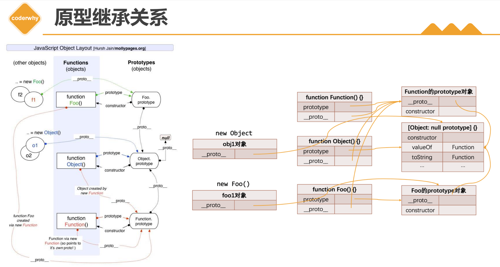


* 原形关系
  * 每个class都有显示原型prototype
  * 每个实例都有隐式原型______proto_\_
  * 实例的______proto_\_指向对应class的prototype
  * 每个构造函数和类都是由new Function() 创建出来，每个显示原型对象都是由 new Object() 创建出来
* 基于原型的查找规则
  * 先在自身属性和方法寻找
  * 如果找不到则自动去___proto_\__中查找


### 2.3原型链


原型链：xxx

* xxx  instanceof  yyy的原理：沿着xxx的隐式原型链查找，然后看显示原型中的constructor是否指向yyy，如果能找到则是yyy的实例，instanceof运算结果为true

注意：

* ECMA只规定语法规则，即代码的书写规范，不规定如何实现
* 以上实现方式都是V8引擎的实现方式，也是主流


### 2.4 ES6之前继承的实现—寄生组合继承(兼容性非常好，`__proto__`和setPrototypeOf有兼容性问题)

```js
    // 创建对象的过程
    function createObject(o) {
      function F() {}
      F.prototype = o
      return new F()
    }

    // 将Subtype和Supertype联系在一起
    // 寄生式函数
    function inherit(Subtype, Supertype) {
      // Subtype.prototype.__proto__ = Supertype.prototype
      // Object.setPrototypeOf(Subtype.prototype, Subtype.prototype)
      Subtype.prototype = createObject(Supertype.prototype)
      Object.defineProperty(Subtype.prototype, "constructor", {
        enumerable: false,
        configurable: true,
        writable: true,
        value: Subtype
      })
    }


// 上面是要在下面使用的工具函数的封装


    // 寄生组合式继承
    // 原型链/借用/原型式(对象之间)/寄生式函数
    function Person(name, age, height) {
      this.name = name
      this.age = age
      this.height = height
    }

    Person.prototype.running = function() {
      console.log("running~")
    }
    Person.prototype.eating = function() {
      console.log("eating~")
    }


    function Student(name, age, height, sno, score) {
      Person.call(this, name, age, height)
      this.sno = sno
      this.score = score
    }

    inherit(Student, Person)
    Student.prototype.studying = function() {
      console.log("studying")
    }

    // 创建实例对象
    var stu1 = new Student("why", 18, 1.88, 111, 100)
```


### 2.5 题目

> * 如何判断一个变量是不是数组?
> * 手写一个简易的jQuery，考虑插件和扩展性(6.9)
> * class的原型本质们如何理解?


### 第三部分 作用域和闭包

### 3.1 作用域和自由变量

> * 说明（专业术语为ES6之前的，ES6之后的专业术语有些不一样，但总体流程基本一致）：作用域链保存在函数对象里面，函数对象被创建时就有了自己得作用域链。作用域链来自于执行得代码，如果执行的是全局代码，作用域链里面只有GO，如果执行函数代码，函数创建的那一刻，它已经知道了自己的作用域链，它会在你执行函数的时候，把作用域链赋值给执行上下文，告诉执行上下文，我的作用域链就是这个东西，你待会按照我这么个顺序查找就行了。
>   
> * 作用域
>   
>   * 全局作用域
>   
>   * 函数作用域
>   
>   * 块级作用域(ES6新增)
>   
>     ```js
>     if (true) {
>     	// 块级作用域
>         let x = 100
>     }
>     console.log(x) // 报错
>     ```
>
> 
>
> * 自由变量
>
>   * 一个变量在当前作用域没有定义，但被使用了
>   * 向上级作用域，一层一层一次寻找，直至找到为止
>   * 如果到全局作用域都没找到，则报错xx is not defined
>
>   图片：xxx


### 3.2闭包

> * 作用域应用的特殊情况，有两种表现
>
>   * 函数作为参数被传递
>
>     ```js
>             // 函数作为参数
>             let a = 100
>             function fn () {
>                 console.log(a);
>             }
>                                                                                                                 
>             function print (fn) {
>                 let a = 200;
>                 fn()
>             }
>                                                                                                                 
>             print(fn)
>     ```
>
>     
>
>   * 函数作为返回值被返回
>
>     ```js
>             // 函数作为返回值
>             function create () {
>                 let a = 100
>                 return function () {
>                     console.log(a);
>                 }
>             }
>     
>             let fn = create()
>             const a = 200
>             fn() // 100
>     ```
>
> * 闭包：自由变量的查找，是在函数定义的地方，向上级作用域查找，不是在执行的地方
>
> * 闭包的特点
>
>   * 记忆性
>   * 内存泄漏


### 3.3 this的几种取值情况

> * 默认绑定：独立调用，圆括号直接调用函数，则函数的上下文是window对象
>
>   * 函数()
>
> * 隐式绑定：对象打点调用它的方法函数，则函数的上下文是这个打点的对象
>
>   * 对象.方法()
>
> * 显示绑定：call/apply/bind
>
> * new 绑定：new的五步走
>
>   * 1.创建一个全新的对象
>   * 2.this指向这个对象
>   * 3.将函数对象的prototype 赋值给实例对象的`__proto__`
>   * 4.执行函数体代码
>   * 5.函数没有返回其他对象，则会返回这个对象
>
> * 内置函数的绑定（经验）
>
>   * 1.定时器，延时器调用函数，上下文是window对象，前提是函数不为箭头函数
>   * 2.事件处理函数的上下文是绑定事件的DOM元素
>     * DOM元素.onclick = function (){};
>
> * 其他绑定规则
>
>   * 数组(类数组对象)枚举出函数进行调用，上下文是这个数组(类数组对象)
>
>     * 数组\[下标]()
>   * IIFE中的函数，上下文是window对象
>
> * call和apply的区别
>
>   * call要用逗号罗列参数
>
>     ```js
>     sum.call(xiaoming, 5, 4)
>     ```
>
>   * apply要把参数写道数组中去
>
>     ```js
>     sum.apply(xiaoming, [5, 4])
>     ```
>


### (补充)this绑定的优先级

> * new > 隐式绑定 > 默认绑定
> * 显示绑定 > 隐式绑定 > 默认绑定
> * new > bind > 隐式绑定 > 默认绑定
> * new 不能和 call/apply一起使用，所以不存在比较优先级这一说法


### (补充) this规则之外

> * 显示绑定中，传入一个null或undefined，这个绑定会被忽略，使用默认规则
>
>   ```js
>           function foo () {
>               console.log(this);
>           }
>   
>           let obj = {
>               name: 'why'
>           }
>   
>           foo.call(obj) // obj对象
>           foo.call(null) // window
>           foo.call(undefined) // window
>   
>           let bar = foo.bind(null)
>           bar() // window
>   ```
>
> * 创建一个函数的间接引用，这种情况使用默认绑定规则
>
>   * 赋值(obj2.foo = obj1.foo)的结果是foo函数
>   * (obj2.foo = obj1.foo)()相当于直接调用foo，是默认绑定


### (补充) 箭头函数 arrow function

> * 箭头函数与普通函数的区别
>
>   * 箭头函数不会绑定this，arguments属性(arguments在ES6之后被剩余参数代替)
>
>   * 箭头函数不能作为构造函数来使用（不能和new一起来使用，会报错），因为它没有原型
>
> * 箭头函数的简写
>
>   * 只有一个参数()可以省略
>   * 函数执行体只有一行代码，那么可以省略{}，并且这行代码的表达式结果会作为函数的返回值
>   * 函数执行体只有返回一个对象，那么需要给这个对象加上（）
>
> * 箭头函数中的this
>
>   * 箭头函数中没有this。普通函数中之所以能绑定this，是因为其内部有this这个标识符，而箭头函数内部没有this标识符，所以不能绑定this。
>   * 箭头函数中使用的this，会像自由变量一样，向上级作用域中寻找
>
> * 作用域说明：
>
>   * ES5之前只有函数有作用域，ES6之后新增块级作用域(if，for...)
>
> * 箭头函数方便的应用常见之一，网络请求
>
>   ```js
>       // 网络请求的工具函数
>       function request(url, callbackFn) {
>         var results = ["abc", "cba", "nba"]
>         callbackFn(results)
>       }
>                               
>       // 实际操作的位置(业务)
>       var obj = {
>         names: [],
>         network: function() {
>           // 1.早期的时候
>           // var _this = this
>           // request("/names", function(res) {
>           //   _this.names = [].concat(res)
>           // })
>                               
>           // 2.箭头函数写法
>           request("/names", (res) => {
>             this.names = [].concat(res)
>           })
>         }
>       }
>                               
>       obj.network()
>       console.log(obj)
>   ```
>
>   


### (补充) this指向面试题

> * 面试题一：
>
>   ```js
>   var name = "window";
>
>   var person = {
>     name: "person",
>     sayName: function () {
>       console.log(this.name);
>     }
>   };
>
>   function sayName() {
>     var sss = person.sayName;
>
>     sss(); // 绑定: 默认绑定, window -> window
>
>     person.sayName(); // 绑定: 隐式绑定, person -> person
>
>     (person.sayName)(); // 绑定: 隐式绑定, person -> person
>
>     (b = person.sayName)(); // 术语: 间接函数引用, window -> window
>   }
>
>   sayName();
>   ```
>
> * 面试题二
>
>   ```js
>   var name = 'window'
>
>   var person1 = {
>     name: 'person1',
>     foo1: function () {
>       console.log(this.name)
>     },
>     foo2: () => console.log(this.name),
>     foo3: function () {
>       return function () {
>         console.log(this.name)
>       }
>     },
>     foo4: function () {
>       return () => {
>         console.log(this.name)
>       }
>     }
>   }
>
>   var person2 = { name: 'person2' }
>
>   // 开始题目:
>   person1.foo1() // 隐式绑定: person1
>   person1.foo1.call(person2) // 显式绑定: person2
>
>   person1.foo2() // 上层作用域: window
>   person1.foo2.call(person2) // 上层作用域: window
>
>   person1.foo3()() // 默认绑定: window
>   person1.foo3.call(person2)() // 默认绑定: window
>   person1.foo3().call(person2) // 显式绑定: person2
>
>   person1.foo4()() // person1
>   person1.foo4.call(person2)() // person2
>   person1.foo4().call(person2) // person1
>   ```
>
> * 面试题三
>
>   ```js
>   var name = 'window'
>   
>   /*
>     1.创建一个空的对象
>     2.将这个空的对象赋值给this
>     3.执行函数体中代码
>     4.将这个新的对象默认返回
>   */
>   function Person(name) {
>     this.name = name
>     this.foo1 = function () {
>       console.log(this.name)
>     },
>     this.foo2 = () => console.log(this.name),
>     this.foo3 = function () {
>       return function () {
>         console.log(this.name)
>       }
>     },
>     this.foo4 = function () {
>       return () => {
>         console.log(this.name)
>       }
>     }
>   }
>   
>   // person1/person都是对象(实例instance)
>   var person1 = new Person('person1')
>   var person2 = new Person('person2')
>   // 面试题目:
>   person1.foo1() // 隐式绑定: person1
>   person1.foo1.call(person2) // 显式绑定: person2
>   
>   person1.foo2() // 上层作用域查找: person1
>   person1.foo2.call(person2) // 上层作用域查找: person1
>   
>   person1.foo3()() // 默认绑定: window
>   person1.foo3.call(person2)() // 默认绑定: window
>   person1.foo3().call(person2) // 显式绑定: person2
>   
>   person1.foo4()() // 上层作用域查找: person1(隐式绑定)
>   person1.foo4.call(person2)() //  上层作用域查找: person2(显式绑定)
>   person1.foo4().call(person2) // 上层作用域查找: person1(隐式绑定)
>
> * 面试题四
>
>   ```js
>     var name = 'window'
>                           
>     /*
>       1.创建一个空的对象
>       2.将这个空的对象赋值给this
>       3.执行函数体中代码
>       4.将这个新的对象默认返回
>     */
>     function Person(name) {
>       this.name = name
>       this.obj = {
>         name: 'obj',
>         foo1: function () {
>           return function () {
>             console.log(this.name)
>           }
>         },
>         foo2: function () {
>           return () => {
>             console.log(this.name)
>           }
>         }
>       }
>     }
>                           
>     var person1 = new Person('person1')
>     var person2 = new Person('person2')
>                           
>     person1.obj.foo1()() // 默认绑定: window
>     person1.obj.foo1.call(person2)() // 默认绑定: window
>     person1.obj.foo1().call(person2) // 显式绑定: person2
>                           
>     person1.obj.foo2()() // 上层作用域查找: obj(隐式绑定)
>     person1.obj.foo2.call(person2)() // 上层作用域查找: person2(显式绑定)
>     person1.obj.foo2().call(person2) // 上层作用域查找: obj(隐式绑定)
>   ```
>
>   


### 3.4手写bind函数

> * ES5版
>
>   ```js
>           // 手写bind函数
>           Function.prototype.binds = function () {
>   
>               // 将参数转化为数组
>               const args = Array.prototype.slice.call(arguments)
>   
>               // 获取this(取出数组的第一项，剩余的就是传递的参数)
>               const t = args.shift()
>   
>               // 当前函数
>               const self = this
>   
>               // 返回一个函数
>               return function () {
>                   return self.apply(t, args)
>               }
>           }
>   ```
>
> * ES6版
>
>   ```js
>           function foo (name, age, height) {
>               console.log(this, name, age, height);
>           }
>             
>           const obj = {
>               name: 'why'
>           }
>             
>   		Function.prototype.hybind = function (thisArg, ...otherArgs) {
>             
>               thisArg = (thisArg === null || thisArg === undefined) ? window : Object(thisArg)
>             
>               Object.defineProperty(thisArg, 'fn', {
>                   enumerable: false,
>                   configurable: true,
>                   writable: false,
>                   value: this
>               })
>               return (...newArgs) => {
>             
>                   const allArgs = [...otherArgs, ...newArgs]
>             
>                   thisArg.fn(...allArgs)
>               }
>           }
>             
>           const newFoo = foo.hybind(obj, 'hhh', 21)
>             
>           newFoo(1.99)
>   ```
>


### 3.5 手写call和apply函数

```js
        function foo (name, age, height) {
            console.log(this, name, age, height);
        }

        const obj = {
            name: 'why'
        }
		
        // 封装通用逻辑
        Function.prototype.execFn = function (thisArg, otherArgs) {
            thisArg = (thisArg === null || thisArg === undefined) ? window : Object(thisArg)

            Object.defineProperty(thisArg, 'fn', {
                enumerable: false,
                configurable: true,
                writable: false,
                value: this
            })
            thisArg.fn(...otherArgs)

            delete thisArg.fn
        }

        Function.prototype.hyapply = function (thisArg, otherArgs) {

            this.execFn(thisArg, otherArgs)
        }


        Function.prototype.hycall = function (thisArg, ...otherArgs) {

            this.execFn(thisArg, otherArgs)

        }

        foo.hyapply(obj, ['james', '1.88'])

        foo.hycall(obj, 'kobe', '1.89')

        foo.hyapply(123, ['why', 18])
        foo.hycall(null, 'why1', 19)
        foo.hycall(undefined, 'why2', 20)
```


 

### 3.6 实际开发中闭包的应用场景

> * 隐藏数据, 做一个简单的cache工具
>
>   ```js
>           function createCache () {
>               const data = {} // 隐藏数据
>               return {
>                   set: function (key, value) {
>                       data[key] = value
>                   },
>                   get: function (key) {
>                       return data[key]
>                   }
>               }
>           }
>                                                         
>           const c = createCache()
>           c.set('a', 100)
>           console.log(c.get('a'));
>   ```
>
> 
>
> * 创建是个<a>，点击弹出序号1~10
>
>   ```js
>           let a
>           // 每次for循环都会创建出一个新的块级作用域
>           for (let i = 0; i < 10; i++) {
>                                                         
>               a = document.createElement('a')
>               a.innerHTML = i + '<br>'
>               a.addEventListener('click', function (e) {
>                   e.preventDefault();
>                   alert(i)
>               })
>                                                         
>               document.body.appendChild(a)
>                                                         
>           }
>   ```
>
>   


### 3.7 输入url到显示页面的整个流程（包括整个浏览器渲染的流程）

> * 第一步：输入url，经过DNS解析成IP地址，找到IP地址对应的服务器，发送请求获取资源（一般都是index.html文件），浏览器获取到文件后，开始解析
> * 第二步：浏览器从上到下一行一行解析，构建DOM树，遇到CSS文件再下载，同时构建CSSOM tree，不阻塞DOM树的构建，但会阻塞render tree的构建。遇见script外部脚本会停止DOM构建，等js文件下载并执行后，再继续构建DOM树。
> * DOM tree和CSSOM构建好后，生成render tree，在经过layout布局计算每个节点的大小和位置后，开始绘制，绘制过程中会合并图层
> * 流程图: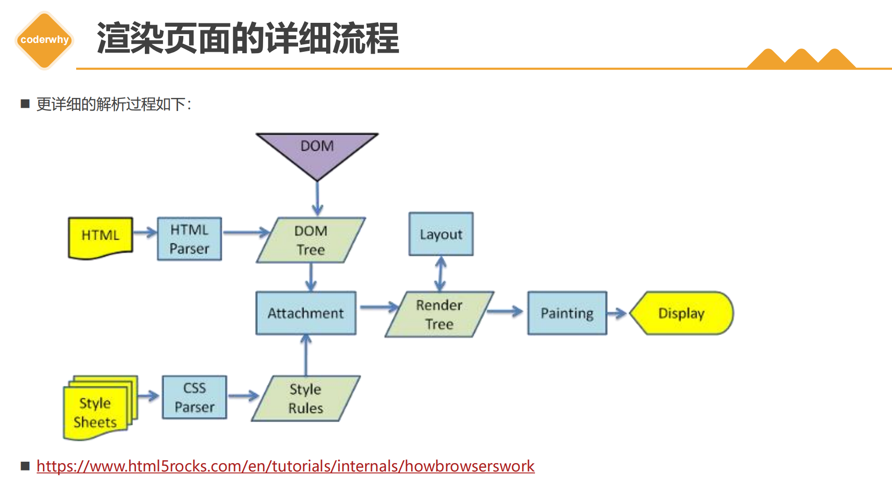

### 3.8 V8引擎的运行原理

> * 第一步：解析JS源代码，词法分析进行分词操作，语法分析解析成真正的JS中的语法，标记到AST抽象语法树中。
>
> * 第二部：经过Ignition解释器，转换成字节码，再转成机器码，CPU执行机器码对应的指令。同时收集TurboFan所需要的信息，如，类型信息。
>
> * 第三步：若函数多次调用，会被标记成热点函数，将热点函数优化成对应的机器码，下次调用可以不经过ignition解释器，直接执行优化后的机器码
>
> * 流程图：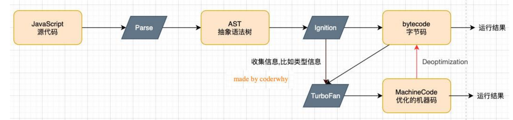
>
>   

### 3.9 JS运行原理流程（包括作用域链）

ES6之前的原理流程，ES6之前，主要是有全局作用域和函数作用域。

> * 第一步：执行全局代码前，会创建GO全局对象，浏览器环境中就是window对象，并且在执行上下文栈中，创建全局执行上下文，每个执行上下文都需要绑定一个VO对象，全局代码中var定义的变量和定义的函数都会放在VO对象中，即window对象中，全局上下文绑定的VO对象就是GO对象。这些全局中的代码，会在这些东西准备好后再执行。
>
> * 第二步：若有函数需要执行，则在执行函数前，在执行上下文栈中，创建函数执行上下文，并且也会绑定一个VO对象，这个VO对象就是AO对象。这个AO对象会使用arguments作为初始化，并且初始值是传入的参数，这个AO对象会作为执行上下文的VO来存放变量的初始化。这些函数体中的代码，会在这些东西准备好后再执行。
>
> * 第三步：每个执行上下文中的代码执行完，就会弹出执行上下文栈。
>
> * 补充：作用域链保存在函数对象里面，函数对象被创建时就有了自己得作用域链。作用域链来自于执行得代码，如果执行的是全局代码，作用域链里面只有GO，如果执行函数代码，函数创建的那一刻，它已经知道了自己的作用域链，它会在你执行函数的时候，把作用域链赋值给执行上下文，告诉执行上下文，我的作用域链就是这个东西，你待会按照我这么个顺序查找就行了。
>
>   
>
> * 这里注意：VO对象中函数定义使用的标识符应该放在变量之前，下面的图这点不对，因为函数比变量优先提升，且函数提升时，会直接创建函数对象，变量不提升值，默认值为undefined
>
> * 流程图：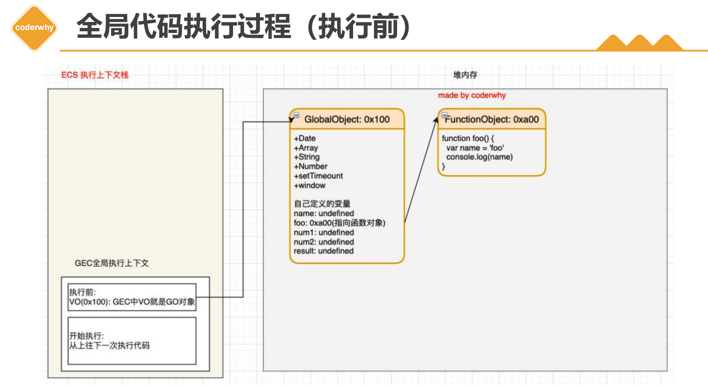
>
> * 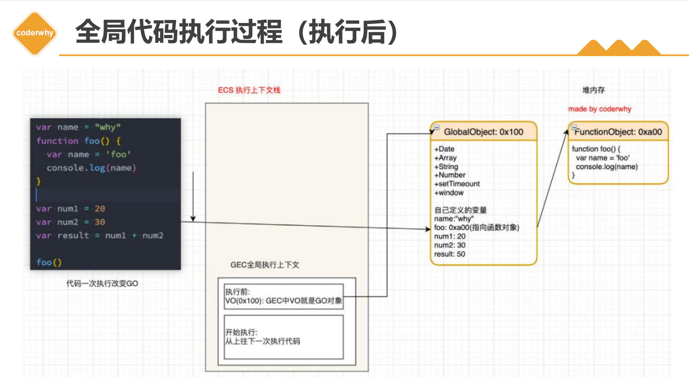
>
> * 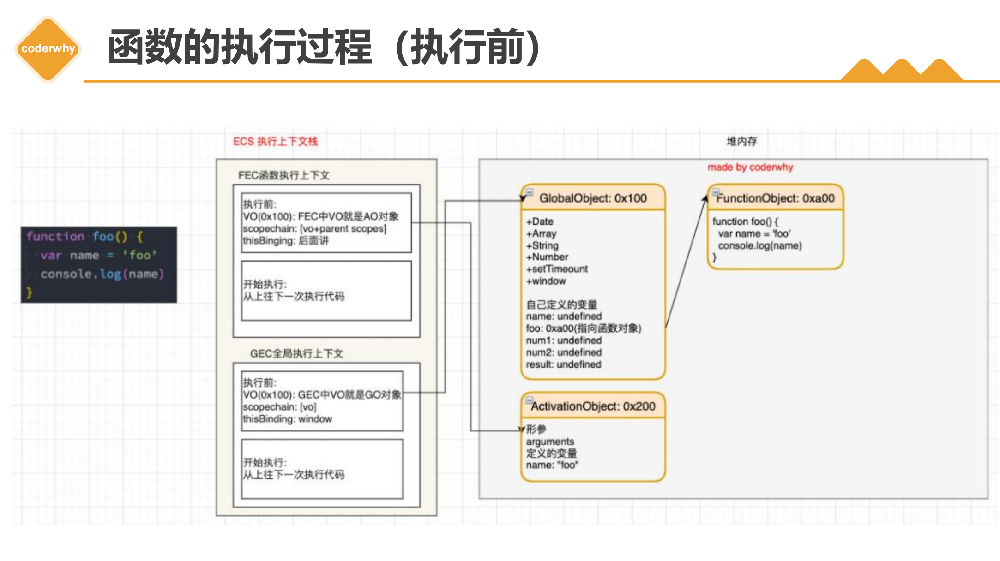
>
> * 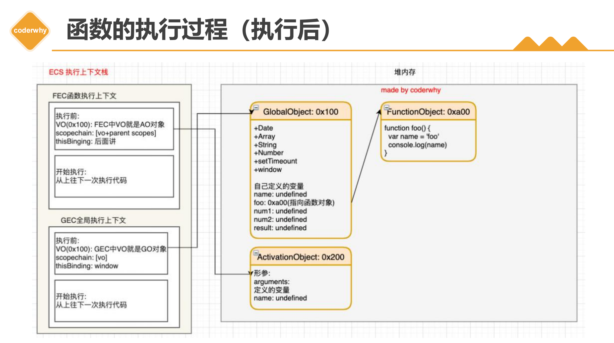


### 3.10 作用域提升面试题

> * 第一题
>
>   ```js
>           var n = 100
>           function foo () {
>               n = 200
>           }
>           foo()
>
>           console.log(n); // 200
>   ```
>
> * 第二题
>
>   ```js
>           function foo () {
>               console.log(n); // underfined
>               var n = 200
>               console.log(n); // 200
>           }
>           var n = 100
>           foo()
>
> 
>
> * 第三题
>
>   ```js
>             var n = 100
>             function foo1 () {
>                 console.log(n); // 2. 100
>             }
>     
>             function foo2 () {
>                 var n = 200
>                 console.log(n); //1. 200
>                 foo1()
>             }
>     
>             foo2()
>             console.log(n); // 3. 100
>   ```
>
>   
>
> * 第四题
>
>   ```js
>           var a = 200
>
>           function foo () {
>               console.log(a); // undefined
>               return
>               var a = 100
>           }
>
>           foo()
>   ```
>
> * 第五题
>
>   ```js
>           function foo () {
>               var a = b = 100
>               // 相当于下面这个
>               // var a = 100
>               // b = 100
>           }
>     
>           foo()
>     
>           console.log(a); // 报错
>           console.log(b); // 100
>   ```
>
> 

### 3.11 内存管理—JS引擎GC机制

> 主要GC算法
>
> * 引用计数法
>
>   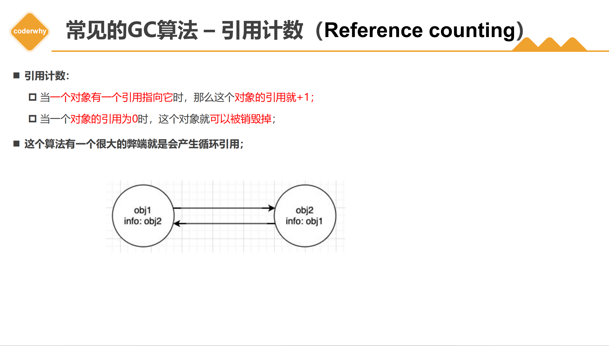
>
>   
>
> * 标记清楚法
>
>   流程图：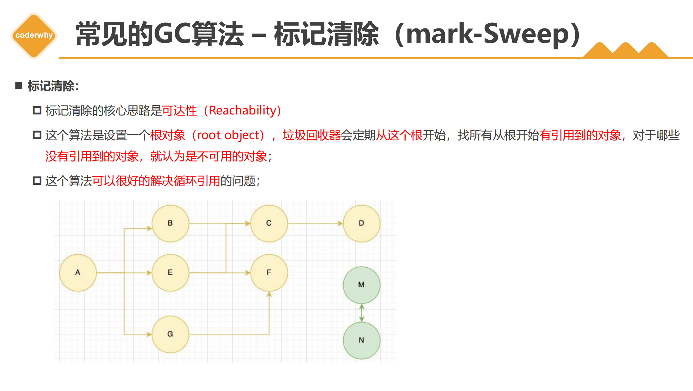
>
> * GC算法-其他算法优化补充
>
>   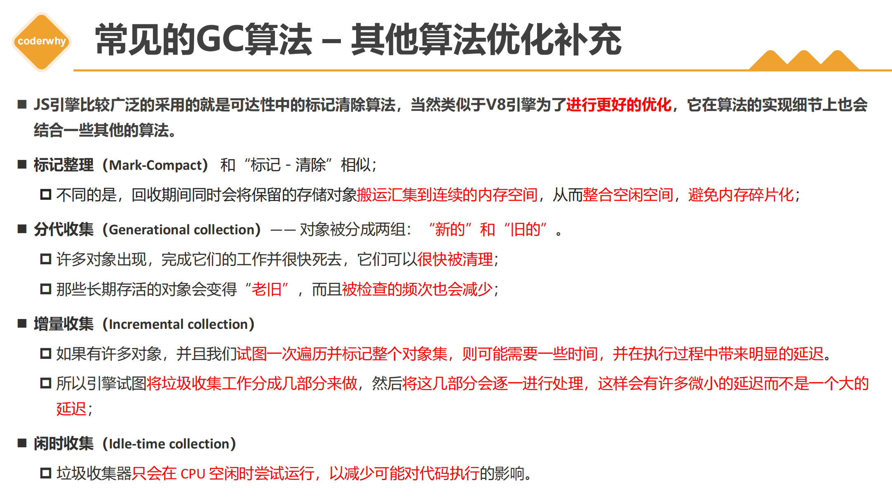


### 3.12闭包

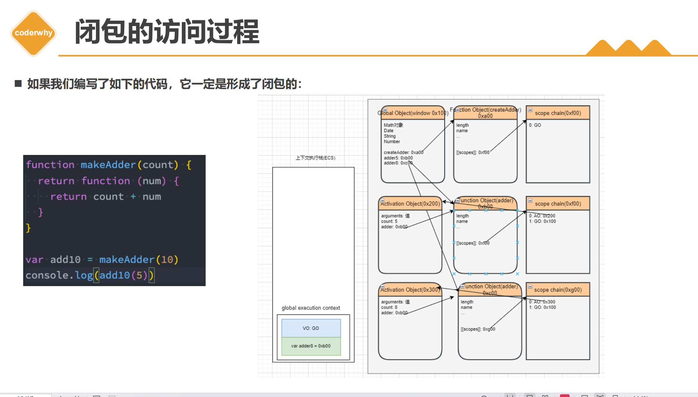


### 3.13题目

> * this的不同应用场景，如何取值？
> * 手写bind函数
> * 手写call函数
> * 手写apply函数
> * 实际开发中闭包的应用场景，举例说明


### 第四部分

### 4.1 单线程和异步

> * 单线程
>   * JS是单线程语言
>   * JS和DOM渲染共用同一个进程，因为JS可修改DOM结构
>   * JS执行时DOM渲染必须停止，DOM渲染时，JS执行停止
> * 异步应用场景
>   * 网络请求
>   * 定时任务


###  4.2 题目

> * 同步和异步的区别是什么？
>
>   * 基于JS是单线程语言
>   * 异步不会阻塞代码执行
>   * 同步会阻塞代码执行
>
> * 手写用Promise加载一张图片
>
>   ```js
>           function loading (src) {
>               return new Promise((resolve, reject) => {
>                   const img = document.createElement('img')
>                     
>                   img.onload = () => {
>                       resolve(img)
>                   }
>                     
>                   img.onerror = () => {
>                       const error = new Error(`图片加载异常 ${src}`)
>                       reject(error)
>                   }
>                     
>                   img.src = src
>               })
>           }
>                     
>           const url1 = 'https://img3.mukewang.com/szimg/64b0cc640982df8805400304.png'
>           const url2 = 'https://img3.mukewang.com/szimg/64b9f4fa09cde80805400304.png'
>           loading(url1).then(img1 => {
>               console.log(img1.width);
>               return img1 // 普通对戏，会被promise对象包裹
>           }).then(img1 => {
>               console.log(img1.height);
>               return loading(url2) // promise对象
>           }).then(img2 => {
>               console.log(img2.width);
>               return img2
>           }).then(img2 => {
>               console.log(img2.height);
>           }).catch(err => {
>               console.log(err);
>           })
>
> 
>
> * 前端使用异步的场景有那些？


## 三 . JS异步进阶

### 1.1 事件循环（5.4）

> * 同步代码，一行一行放在Call Stack中执行
> * 遇到异步，会先“记录”下来，等待时机(定时，网络请求等)
> * 时机到了，就移动到Callback Queue
> * 如 Call Stack为空( 即同步代码执行完) Event Loop开始工作
> * 轮询查找Callback Queue，如有则移动到Call Stack执行
> * 然后继续轮询查找（永动机一样）

### 1.2 DOM事件和Eventloop的关系（5.5）

> * JS是单线程的
> * 异步（setTimeOut，ajax）使用回调，基于Event Loop
> * DOM事件也使用回调，基于Event Loop


### 1.3 三种状态

> * pending	fulfilled	rejected
> * pending -> fulfilled 或 pending -> rejected
> * 变化不可逆
> * pending不会触发then和catch
> * fulfilled会触发后续的then回调函数
> * rejected会触发后续的catch回调函数


### 1.4 then和catch对状态的影响

> * then正常返回fulfilled，里面有报错则返回rejected
> * catch正常返回fulfilled，里面有报错则返回rejected


### 1.5 Promise关于then和catch的面试题

> * 第一题
>
>   ```js
>           Promise.resolve().then(() => {
>               console.log(1); // 1
>           }).catch(() => {
>               console.log(2);
>           }).then(() => {
>               console.log(3); // 3
>           })
>   ```
>
> * 第二题
>
>   ```js
>           Promise.resolve().then(() => {
>               console.log(1); // 1
>               throw new Error('error1')
>           }).catch(() => {
>               console.log(2); // 2
>           }).then(() => {
>               console.log(3); // 3
>           })
>   ```
>
> * 第三题
>
>   ```js
>           Promise.resolve().then(() => {
>               console.log(1); // 1
>               throw new Error('error1')
>           }).catch(() => {
>               console.log(2); // 2
>           }).catch(() => {
>               console.log(3);
>           })
>   ```
>
>   


### 2.1 async/await和Promise的关系

> * 执行async函数，返回的是promise对象
>
>   ```js
>           async function fn1 () {
>               return 100 // 相当于 return Promise.resolve(100)
>               // return Promise.resolve(200)
>           }
>           const res = fn1() // 执行async函数，返回的是一个Promise对象
>           console.log('res', res); // Promise对象
>           res.then(res => {
>               console.log('data', res); // 100
>           })
>   ```
>
> 
>
> * await相当于Promise中的then
>
>   ```js
>           (async function () {
>               const p1 = Promise.resolve(300)
>               const data = await p1 // await相当于Promise的then
>               console.log(data); // 300
>           })()
>
>
> ```js
>       !(async function () {
>           const data = await 400 // 相当于 await Promise.resolve(400)
>           console.log('data', data); // 400
>       })()
> 
> ```
> * try...catch可捕获异常，代替了Promise的catch
>
>   ```js
>           (async function () {
>               const p1 = Promise.reject('error')
>               try {
>                   const data = await p1
>                   console.log(data);
>               } catch (error) {
>                   console.log(error); // try..catch相当于Promise的catch
>               }
>           })()
>                                               
>   ```
>
> 


### 2.2 异步的本质还是回调函数

> * 题目一
>
>   ```js
>           // script start
>           // async1 start
>           // async2
>           // script end
>           // async1 end
>           async function async1 () {
>               console.log('async1 start'); // 2
>               await async2()
>               // await的后面，都可以看作 callback里的内容，即异步
>               console.log('async1 end'); // 5
>           }
>   
>           async function async2 () {
>               console.log('async2'); // 3
>           }
>   
>           console.log('script start'); // 1
>           async1()
>           console.log('script end'); // 4
>   ```
>
> * 题目二
>
>   ```js
>           async function async1 () {
>               console.log('async1 start'); // 2
>               await async2()
>               // await的后面，都可以看作 callback里的内容，即异步
>               console.log('async1 end'); // 5
>               await async3()
>               console.log('async1 end 2'); // 7
>           }
>                           
>           async function async2 () {
>               console.log('async2'); // 3
>           }
>                           
>           async function async3 () {
>               console.log('async3'); // 6
>           }
>                           
>           console.log('script start'); // 1
>           async1()
>           console.log('script end'); // 4
>   ```
>
>   


### 2.3 宏任务与微任务

> * 宏任务：setTimeOut，setInterval，Ajax，DOM事件
> * 微任务：Promise / async await
> * 微任务执行时机比宏任务早 


### 2.4 Event Loop与DOM渲染的关系

> * 每次Call Stack清空，即同步任务执行完
> * 都是DOM重新渲染的机会，DOM结构如有改变则重新渲染
> * 然后再去触发下一次Event Loop


### 2.5 微任务和宏任务的区别

> * 宏任务：DOM渲染后触发
> * 微任务：DOM渲染前触发


### 2.6 宏任务和微任务总结(5.15)

> * 宏任务有哪些？微任务有哪些？微任务触发时机更早
> * 微任务，宏任务和DOM渲染的关系
> * 微任务，宏任务和DOM渲染，在Event Loop的过程
> * 图片：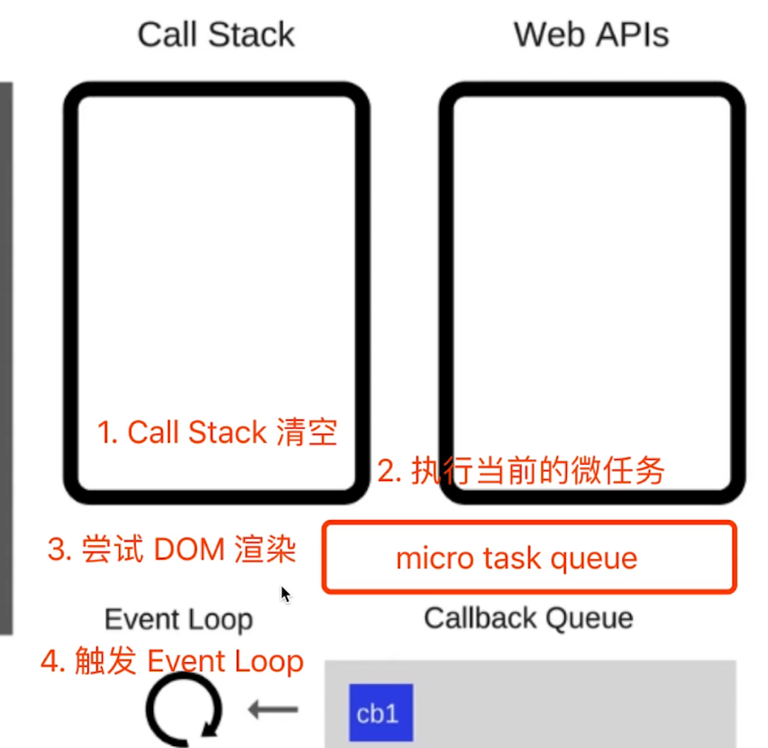


### 2.7 JS异步面试题

> * ```js
>           async function fn () {
>               return 100
>           }
>           !(async function () {
>               const a = fn() // Promise对象
>               const b = await fn() // 100
>           })()
>   ```
>
> * ```js
>           (async function () {
>               console.log('start');
>               const a = await 100
>               console.log('a', a);
>               const b = await Promise.resolve(200)
>               console.log('b', b);
>               const c = await Promise.reject(300)
>               console.log('c', c);
>               console.log('end');
>                                                                                                                                             
>           })() // 执行完毕，打印什么内容
>                // 打印至b就因reject报错，而结束
>   ```
>
> * ```js
>           async function async1 () {
>               console.log('async1 start'); // 2
>               await async2()
>               console.log('async1 end'); // 6
>           }
>                                                 
>           async function async2 () {
>               console.log('async2'); // 3
>           }
>           console.log('script start'); // 1
>                                                 
>           setTimeout(function () {
>               console.log('setTimeout'); // 8
>           }, 0)
>                                                 
>           async1()
>                                                 
>           new Promise(function (resolve) {
>               console.log('promise1'); // 4
>               resolve()
>           }).then(() => {
>               console.log('promise2'); // 7
>           })
>                                                 
>           console.log('script end'); // 5
>   ```


### 3. 手写Promise

> * 初始化&异步调用
>
> * then catch 链式调用
>
> * API：.resolve    .reject    .all    .race
>
>   ```js
>           class MyPromise {
>               state = 'pending';
>               value = undefined // 成功后的值
>               reason = undefined // 失败后的值
>               resolveCallbacks = [] // pending状态时，收集成功的回调
>               rejectCallbacks = []  // pending状态时，收集失败的回调
>               constructor(fn) {
>                   const resolveHandler = (value) => {
>                       if (this.state === 'pending') {
>                           this.state = 'fulfilled'
>                           this.value = value
>                           this.resolveCallbacks.forEach(fn => fn() )
>                       }
>                                               
>                   }
>                   const rejectHandler = (reason) => {
>                       if (this.state === 'pending') {
>                           this.state = 'rejected'
>                           this.reason = reason
>                           this.rejectCallbacks.forEach(fn => fn() )
>                       }
>                                               
>                   }
>                   try {
>                       fn(resolveHandler, rejectHandler)
>                   } catch (error) {
>                       rejectHandler(error)
>                   }
>                                               
>               }
>               then (fn1, fn2) {
>                   fn1 = typeof fn1 === 'function' ? fn1 : v => v
>                   fn2 = typeof fn2 === 'function' ? fn2 : e => e
>                   // self = this
>                   if (this.state === 'pending') {
>                       const p1 = new MyPromise((resolve, reject) => {
>                           this.resolveCallbacks.push(() => {
>                               try {
>                                   const newValue = fn1(this.value)
>                                   resolve(newValue)
>                               } catch (error) {
>                                   console.error(error);
>                               }
>                           })
>                           this.rejectCallbacks.push(() => {
>                               try {
>                                   const newReason = fn2(this.reason)
>                                   reject(newReason)
>                               } catch (error) {
>                                   console.error(error);
>                               }
>                           })
>                       })
>                       // console.log(p1 === this);
>                       return p1
>                                               
>                   }
>                   if (this.state === 'fulfilled') {
>                       const p1 = new MyPromise((resolve, reject) => {
>                           try {
>                               const newValue = fn1(this.value)
>                               resolve(newValue)
>                           } catch (error) {
>                               reject(error)
>                           }
>                       })
>                       return p1
>                   }
>                   if (this.state === 'rejected') {
>                       const p1 = new MyPromise((resolve, reject) => {
>                           try {
>                               const newReason = fn2(this.reason)
>                               reject(newReason)
>                           } catch (error) {
>                               reject(error)
>                           }
>                       })
>                       return p1
>                   }
>                                               
>               }
>               catch (fn) {
>                   return this.then(null, fn)
>               }
>           }
>                                               
>           // Promise的静态方法
>                                               
>           MyPromise.resolve = function (value) {
>               return new MyPromise((resolve, reject) => { resolve(value) })
>           }
>                                               
>           MyPromise.reject = function (reason) {
>               return new MyPromise((resolve, reject) => { reject(reason) })
>           }
>                                               
>           // 传入promise数组，等待所有的都fulfilled之后，返回新promise，包含前面的所有结果
>           MyPromise.all = function (promiseList = []) {
>               const p1 = new MyPromise((resolve, reject) => {
>                   const result = [] // 存放promiseList中的所有值
>                   const length = promiseList.length
>                   let resolveCount = 0
>                   promiseList.forEach((p, index) =>
>                       p.then(data => {
>                           result.push(data)
>                           // 这里不能使用index，因为index是同步的，无法等待异步完成
>                           // resolveCount放在promise里面
>                           resolveCount++
>                           if (resolveCount === length) {
>                               resolve(result)
>                           }
>                       }).catch(err => {
>                           reject(err)
>                       })
>                   )
>               })
>               return p1
>           }
>                                               
>           // 传入promise数组，只要有一个fulfilled，即可返回新promise
>           MyPromise.race = function (promiseList = []) {
>               let resolved = false
>               const p1 = new MyPromise((resolve, reject) => {
>                   promiseList.forEach(p => {
>                       p.then(data => {
>                           if (!resolved) {
>                               resolve(data)
>                               resolved = true
>                           }
>                       }).catch(err => {
>                           reject(err)
>                       })
>                   })
>               })
>               return p1
>           }
>   ```
>
> 


## 四. JS-Web-API

### 第一部分 - DOM

### 1.1 DOM本质

> * DOM是HTML解析出的树结构

### 1.2 DOM节点操作

> ```js
>         document.getElementById()
>         document.getElementsByClassName()
>         document.getElementsByTagName
>         document.querySelector()
>         document.querySelectorAll()
> ```
>
> 

### 1.3 DOM结构操作

> ```js
>         const div1 = document.getElementById('div1')
>         const div2 = document.getElementById('div2')
> 
>         // 新建节点
>         const newP = document.createElement('p')
>         newP.innerHTML = 'this is newP'
> 
>         // 插入节点
>         div1.appendChild(newP)
> 
> 
>         //移动节点
>         const p1 = document.getElementById('p1')
>         div2.appendChild(p1)
> 
>         // 获取父元素
>         const parent = div1.parentNode
> 
>         // 获取子元素
>         const child = div1.childNodes
> 
>         parent.nodeName
>         parent.nodeType
> 
> 
>         // 删除节点
>         div.removeChild(child[0])
> ```


### 1.4 property和attribute的区别(7.3)

> * property：修改对象属性，不会提现到html结构中
> * attribute：修改html属性，会改变html结构
> * 两者都有可能引起DOM重新渲染，推荐优先使用property


### 1.5 DOM性能

> * 对DOM查询做缓存
>
>   ```js
>           // 不缓存DOM查询结果
>           for (let i = 0; i < document.getElementsByTagName('p').length; i++) {
>               //每次循环,都会计算length,频繁进行DOM查询
>           }
>   
>         // 缓存DOM查询结果
>         const pList = document.getElementsByTagName('p')
>         const length = pList.length
>         for (let i = 0; i < length; i++) {
>             // 缓存length,只进行一次DOM查询
>         }
>
> * 将频繁操作改成一次性操作
>
>   ```js
>             const listNode = document.getElementById('list')
>                           
>             // 创建一个文档碎片,此时还没有插入到DOM树中
>             const frag = document.createDocumentFragment()
>                           
>             // 执行插入
>             for (let i = 0; i < 10; i++) {
>                 const li = document.createElement('li')
>                 li.innerHTML = `list item ${i}`
>                           
>                 // 先插入文档碎片中,其游离在DOM树之外
>                 frag.appendChild(li)
>             }
>                           
>             // 都完成之后,再插入到DOM树中
>             listNode.appendChild(frag)
>   ```
>
>   


### 1.6 题目


### 第二部分 - BOM

### 2.1 四个对象

> * navigator
>
> * screen
>
>   ```js
>   screen.width
>   screen.height
>   ```
>
>   
>
> * location
>
>   ```js
>           console.log(location.href); // 完整路径:https://abc.com/class/123.html?name=why&age=18#Anchor
>           console.log(location.protocol); // 协议 http/https
>           console.log(location.pathname); // 路径 /class/123.html
>           console.log(location.search);   // 查询字符串 ?name=why&age=18
>           console.log(location.hash);     // hash(#号后的内容) #Anchor
>   ```
>
>   
>
> * history
>
>   ```js
>   history.back()
>   history.forward()
>   ```
>
>   


### 2.2 题目

> * 如何识别浏览器
>
>   ```js
>           const ua = navigator.userAgent
>           const isChrome = ua.indexOf('Chrome')
>           console.log(isChrome);
>   ```
>
> * 拆解url各个部分


### 第三部分

### 3.1 事件绑定


> * 通用事件绑定函数
>
>   ```js
>           function bindEvent (elem, type, selector, fn) {
>               if (fn == null) {
>                   fn = selector
>                   selector = null
>               }
>                   
>               elem.addEventListener(type, e => {
>                   const target = e.target
>                   // 事件代理
>                   if (selector) {
>                       if (target.matches(selector)) {
>                           fn.call(target, e)
>                       }
>                   } else {
>                       // 普通绑定
>                       fn.call(target, e)
>                   }
>               }, false)
>           }
>           // 普通绑定
>           const btn1 = document.getElementById('btn1')
>           bindEvent(btn1, 'click', function (event) {
>               event.preventDefault()
>               alert(this.innerHTML)
>           })
>                   
>           // 事件代理
>           const div3 = document.getElementById('div3')
>           bindEvent(div3, 'click', 'a', function (event) {
>               event.preventDefault()
>               alert(this.innerHTML)
>           })
>   ```
>


### 3.2 事件冒泡

> * 基于DOM树形结构
> * 事件会顺着触发元素往上冒泡
> * 应用场景：代理


### 3.3 事件代理

> * 代码简介，减少浏览器内存占用
>
> * 无限下拉的图片列表，如何监听每个图片的点击
>
>   ```html
>       <div id="list">
>           <a href="#">a1</a>
>           <a href="#">a2</a>
>           <a href="#">a3</a>
>           <a href="#">a4</a>
>           <a href="#">a5</a>
>           <button id="btn">点我</button>
>       </div>
>   ```
>
>   ```js
>   		const list = document.getElementById('list')
>           list.addEventListener('click', (e) => {
>               const target = e.target
>               if (e.nodeName === 'A') {
>                   alert(target.innerHTML)
>               }
>           })
>   ```
>
>   


### 3.4 题目

> * 编写一个通用的事件监听函数
> * 描述事件冒泡的流程
> * 无线下拉的图片列表，如何监听每个图片的点击


### 第四部分

### 4.1 Ajax的核心API

> * xhr.readyState
>   * 0 - UNSET 尚未调用open方法
>   * 1 - OPENED open方法已被调用
>   * 2 - HEADERS_RECEIVED send方法已被调用
>   * 3 - LOADING 下载中，responseText已有部分内容
>   * 4 - DONE 下载完成
> * xhr.status
>   * 2xx - 表示成功处理请求
>   * 3xx - 需要重定向，浏览器直接跳转，如301，302，304
>   * 4xx - 客户端请求错误，如404，403
>   * 5xx - 服务器错误

```js
// get请求
const xhr = new XMLHttpRequest()
xhr.open('GET','/data/test.json',true)

xhr.onreadystatechange = function () { 
    if (xhr.readyState === 4) {
        if (xhr.status === 200) { 
            console.log(JSON.parse(xhr.responseText));
        }
    } else {
        console.log('其他情况');
     }
}

xhr.send(null)


// POST请求
const xhr = new XMLHttpRequest()
xhr.open('POST','/login',true)

xhr.onreadystatechange = function () { 
    if (xhr.readyState === 4) {
        if (xhr.status === 200) { 
            console.log(JSON.parse(xhr.responseText));
        }
    } else {
        console.log('其他情况');
     }
}

const postData = {
    name: 'why',
    password:123456
}

xhr.send(JSON.stringify(postData))
```


### 4.2 同源策略

> * ajax请求时，浏览器要求当前网页和server必须同源
>
> * 同源：协议，域名，端口，三者必须一致
>
> * 加载图片 css js 可无视同源策略
>
>   ```html
>   
>   <link href="跨域的css地址">
>   <script src="跨域的js地址"></script>
>   ```
>
> * 跨域：所有的跨域，都必须经过server端允许和配合


### 4.3 常见实现跨域的方式(8.7)

> * JSONP
>   * \<script>可绕过跨域限制；
>   * 服务器可任意动态拼接数据返回
>   * 只要服务端同意，script就可以获得跨域的数据
> * CORS
>   * 由服务端设置http header中的Access-Control-Allow-Origin
> * Node反向代理
> * Nginx代理


### 4.4 手写一个简易的ajax

```js
function ajax (url) {
    return new Promise((resolve, reject) => {
        const xhr = new XMLHttpRequest()
        xhr.open('GET', url, true)
        xhr.onreadystatechange = () => {
            if (xhr.readyState === 4) { 
                if (xhr.status === 200) {
                    resolve(
                        JSON.parse(xhr.responseText)
                    )
                } else if (xhr.status === 404) {
                    reject(new Error('404 Not Found'))
                 }
            }
        }
        xhr.send(null)
     })
}

ajax('/data/test.json')
    .then(res => { 
        console.log(res);
    }).catch(error => { 
        console.log(error);
    })
```


### 4.3 cookie

> * cookie
>   * 本身用于浏览器和server的通讯
>   * html5之前被”借用“到本地存储来
>   * 可用document.cookie = '...'来修改
> * cookie的缺点
>   * 存储大小，最大4KB左右
>   * http请求时需要发送到服务端，增加请求数据量
>   * 只能用document.cookie = '...'来修改，过于简陋，key相同覆盖，不同追加


### 4.4 localStorage和sessionStorage

> * 作用
>   * HTML5专为存储而设计，最大可存储5M左右
>   * API简单易用 setItem getItem removeItem clear
>   * 不会随着http请求被发送出去
> * 特点
>   * localStorage数据回永久存储，除非代码或手动删除
>   * sessionStorage数据只存在于当前会话，浏览器关闭则清空
>   * 一般用localStorage会更多一些


### 4.5 描述cookie localStorage sessionStorage的区别

> * 容量
> * API易用性
> * 是否跟随http请求发送出去


## 五. HTTP

### 第一部分

### 1.1 http常见状态码

> * 状态码分类
>   * 1xx 服务器收到请求
>   * 2xx 请求成功，如200
>   * 3xx 重定向，如302
>   * 4xx 客户端错误，如404
>   * 5xx 服务端错误，如500
> * 常见状态码
>   * 200，请求成功
>   * 301 永久重定向（配合location，浏览器自动处理），请求一次返回301后，浏览器会记住那些网址返回301，以后直接访问location中的新网址，不再访问旧网址。适用于，域名过期，更换域名，老网站等
>   * 302 临时重定向（配合location，浏览器自动处理），每次都会访问老地址，并根据返回的location访问新地址。但是浏览器会做缓存，可以清除缓存。
>   * 304 资源未被修改，表示请求的资源没有变，浏览器本地缓存的结果仍是最新的，可以继续使用。
>   * 404 资源未找到
>   * 403 没有权限
>   * 500 服务器错误
>   * 504 网关超时，能访问通服务器，但服务器访问其他服务器或连接数据库超时等。


### 1.2 Restful-API

> * 传统的method
>
>   * get 获取服务器的数据
>   * post 向服务器提交数据，删除等操作，可通过post模拟
>
> * 现在的method
>
>   * get 获取数据
>   * post 新建数据
>   * patch/put 更新数据
>   * delete 删除数据
>
> * 传统API设计：把每个url当作一个功能
>
> * Restful API设计：把每个url当作一个唯一的资源
>
> * 如何设计成一个资源
>
>   * 尽量不用url参数
>
>     * 传统API设计：/api/list?pageIndex=2，一个功能，获取列表第二页
>     * 用method标识操作类型（传统API设计，不看请求，光看url就可以知道功能）
>       * post请求 /api/create-blog
>       * post请求 /api/update-blog?id=100
>       * get请求 /api/get-blog?id=100
>     * Restful API设计：/api/list/2，一个资源的标识
>     * 用method标识操作类型（Restful API设计，光看url只知道是某个资源的标识，不知道干嘛，再看method就知道要干嘛）
>       * post请求 /api/blog/
>       * patch请求 /api/blog/100
>       * get请求 /api/blog/100
>
>   * 用method表示操作类型
>
>     


### 1.3 http那些常见header

> * Request Headers
>   * Accept：浏览器可接受的数据格式
>   * Accept-Encoding：浏览器可接受的压缩算法，如gzip
>   * Accept-Language：浏览器可接收的语言，如zh-CN
>   * Connection：keep-alive 一次TCP连接重复利用
>   * cookie
>   * Host：请求的域名是什么
>   * User-Agent（简称UA）：使用的浏览器信息或系统信息
>   * Content-type：发送数据的格式，如application/json
> * Response Headers
>   * Content-type：返回数据的格式，如application/json
>   * Content-length：返回数据的大小，多少字节
>   * Content-Encoding：返回数据的压缩算法，如gzip
>   * Set-Cookie：服务端要修改cookie，通过这个
> * 自定义header
>   * headers:{ 'xxx' : 'xxx' }，可以放一些密钥来进行简单的验证


### 1.4 http缓存

> * 什么是缓存：讲一些不必要再次请求的资源缓存下来，如图片等
> * 为什么需要缓存：网络请求的加载相比于CPU的计算和页面的渲染是非常慢的，这时将一些不变的，不必要再次请求的资源存储下来，减少请求次数，可大大提高性能
> * 哪些资源可以被缓存？— 静态资源（img，css，js），这些静态资源使用webpack打包时，webpack会根据内容生成一段hash值，作为文件名字的一部分。如果内容变，文件也会重新生成。


### 1.5 http-强制缓存(9.7)

> * 图片：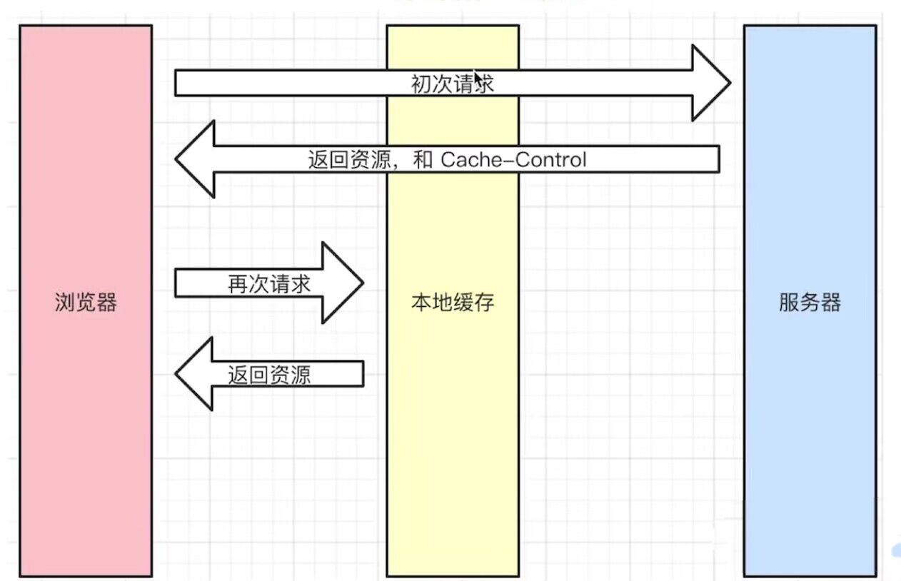
> * Cache-Control由服务端设置，控制强制缓存的逻辑，在Response Headers中
>   * 例如 Cache-Control: max-age=xxx(单位是秒)
> * Cache-Control的值
>   * max-age(常用)：设置有效时间
>   * no-cache(常用)：不用强制缓存，交给服务器，让服务器来处理
>   * no-store：不用强制缓存，也不让服务器做缓存
>   * private：只允许用户做缓存，比如电脑，浏览器，手机
>   * public：允许中间路由或代理做缓存
> * Expires
>   * 同在Response Headers中
>   * 同为控制缓存过期
>   * 已被 Cache-Control代替

### 1.6 http-协商缓存(9.8)

> * 图片：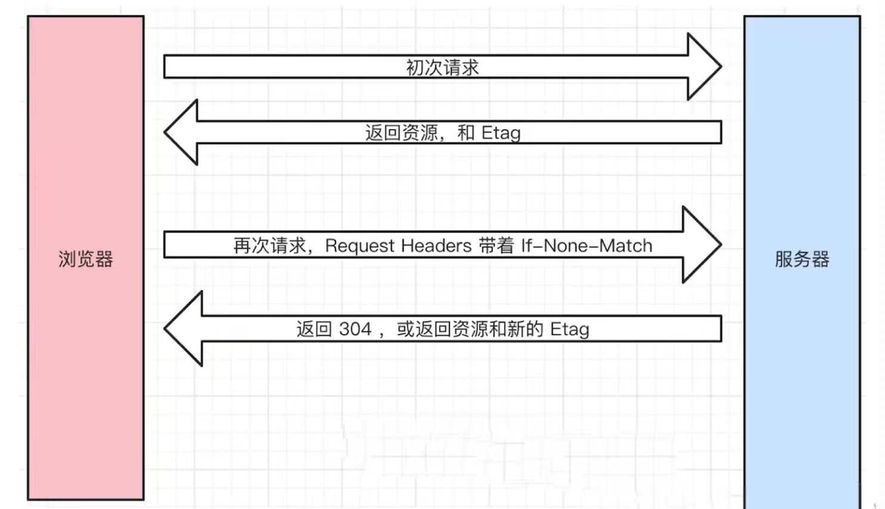
> * 协商缓存
>   * 服务端缓存策略
>   * 服务端判断客户端资源，是否和服务端资源一样
>   * 一致则返回304，否则返回200和最新的资源
> * 资源标识(在Response Headers中，有两种)
>   * Last-Modified 资源的最后修改时间
>     * 初次返回资源和Last-Modified
>     * 再次请求 Request Headers 带着if-Modified-Since，其值和Last-Modified相等
>     * 服务器比较if-Modified-Since的值，和服务器的资源最新修改时间是否相等
>     * 相等返回304，或返回200，最新的资源和Last-Modified
>   * Etag 资源的唯一标识（一个字符串，类似人类的指纹）
>     * 初次返回资源和Etag
>     * 再次请求Request Headers带着if-None-Match，其值和Etag相等
>     * 服务端检测到有if-None-Match，则重新根据内容计算资源的Etag，比较是否相等
>     * 相等返回304，或返回资源和新的Etag
>   * Last-Modified 和 Etag可以共存
>     * 会优先使用Etag
>     * Last-Modified智能精确到秒级
>     * 如果资源被重新生成，而内容不变，则Etag更准确
> * http缓存-流程图：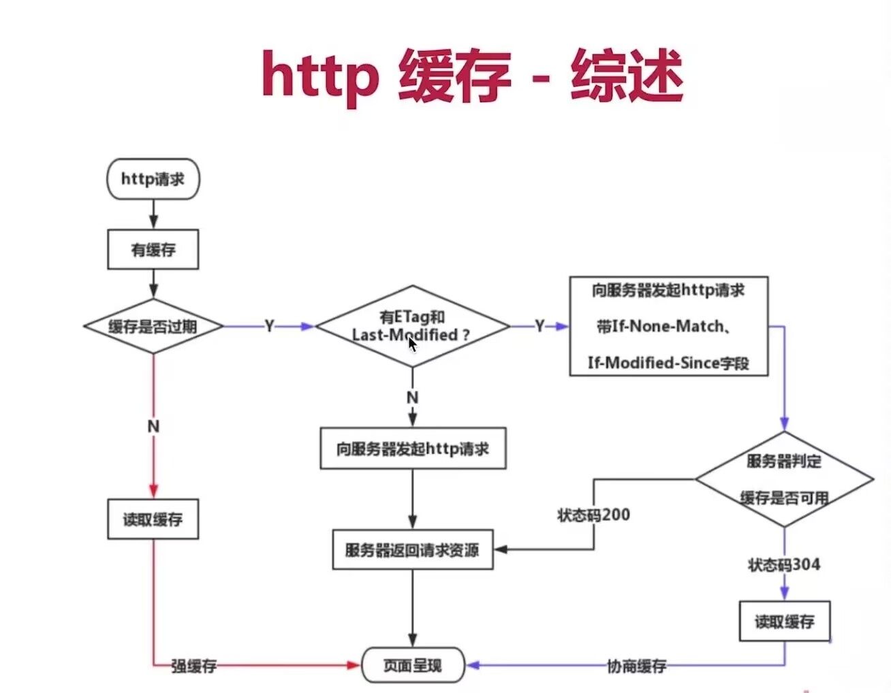


### 1.7 三种刷新操作对http缓存的影响

> * 正常操作：地址栏输入url，跳转链接，前进后退等
>   * 强制缓存有效，协商缓存有效
> * 手动刷新：F5，点击刷新按钮，右击菜单刷新
>   * 强制缓存失效，协商缓存有效
> * 强制刷新：ctrl + F5
>   * 强制缓存失效，协商缓存失效


### 1.8 https(9.10)

> * http和https的区别
>   * http是明文传输，敏感信息容易被中间劫持
>   * https = http + 加密，劫持了也无法解密
>   * 现代浏览器已开始强制https协议
> * 加密方式
>   * 对称加密：一个key同负责加密，解密
>   * 非对称加密：一对key（key和pubkey），A加密后，只能用B解密


### 1.9 http证书(9.11)


### 1.10 题目

> * http常见的状态码有那些
> * http常见的header有哪些
> * 什么是Restful API
> * 描述一下http的缓存机制


# 二面

### 手写Vue2的响应式原理

```js

// 不同的对象通过创建实例，有不同的dep
class Depend {
    constructor() { 
        // 使用Set，防止重复添加函数
        this.reactiveFns = new Set()
    }

    addDepend (fn) { 
        if (fn) { 
            this.reactiveFns.add(fn)
        }
    }

    depend () { 
        this.addDepend(reactiveFn)
     }

    notify () { 
        this.reactiveFns.forEach(fn=>fn())
     }
}
 

// 存储需要添加到依赖数组中的函数
let reactiveFn 
function watchFn (fn) { 
    reactiveFn = fn 
    fn()
    reactiveFn = null
}


// 通过obj的key获取对应的dep对象
/**
  * 1.dep对象数据结构的管理(最难理解)
    * 每一个对象的每一个属性都会对应一个dep对象
    * 同一个对象的多个属性的dep对象是存放一个map对象中
    * 多个对象的map对象, 会被存放到一个objMap的对象中
  * 2.依赖收集: 当执行get函数, 自动的添加fn函数
 */
const objMap = new WeakMap()
function getDepend (obj,key) {
    let map = objMap.get(obj)
    if (!map) { 
        map = new Map()
        objMap.set(obj,map)
    }
    
    let dep = map.get(key)
    if (!dep) { 
        dep = new Depend()
        map.set(key,dep)
    }
    
    return dep
 }

// Vue2响应式实现 - Object.defineProperty
function reactive (obj) {
    Object.keys(obj).forEach(key => {
        let value = obj[key]
        Object.defineProperty(obj, key, {
            set (newValue) { 
                value = newValue
                const dep = getDepend(obj,key)
                dep.notify()
             },
            get () {
                const dep = getDepend(obj,key)
                dep.depend()
                return value
             }
        })
    })
    return obj
}


const obj = reactive({
    name: 'why',
    age: 18,
    height:1.88
})

watchFn(function foo () { 
    console.log('foo: ', obj.name);
    console.log('foo: ', obj.age);
    console.log('foo: ', obj.age);
})
 
watchFn(function bar () { 
    console.log('bar: ', obj.age);
})

watchFn(function tom () { 
    console.log('tom: ', obj.name);
    console.log('tom: ', obj.height);
})
 
console.log('-------------age改变');
obj.age = 21

console.log('-------------name改变');
obj.name = 'james'


const user = reactive({
    username: '哈哈哈',
    password:123456
})

watchFn(function userFoo () { 
    console.log('userFoo ',user.username);
    console.log('userFoo:',user.password);
})
 

watchFn(function userBar () { 
    console.log('userBar',user.password);
})
 
console.log('-----------username修改了');
user.username = '好好好'

console.log('-----------password修改了');
user.password = 666666
```


### 手写 Vue3的响应式原理

```js
// 不同的对象通过创建实例，有不同的dep
class Depend {
    constructor() { 
        // 使用Set，防止重复添加函数
        this.reactiveFns = new Set()
    }

    addDepend (fn) { 
        if (fn) { 
            this.reactiveFns.add(fn)
        }
    }

    depend () { 
        this.addDepend(reactiveFn)
     }

    notify () { 
        this.reactiveFns.forEach(fn=>fn())
     }
}
 

// 存储需要添加到依赖数组中的函数
let reactiveFn 
function watchFn (fn) { 
    reactiveFn = fn 
    fn()
    reactiveFn = null
}


// 通过obj的key获取对应的dep对象
/**
  * 1.dep对象数据结构的管理(最难理解)
    * 每一个对象的每一个属性都会对应一个dep对象
    * 同一个对象的多个属性的dep对象是存放一个map对象中
    * 多个对象的map对象, 会被存放到一个objMap的对象中
  * 2.依赖收集: 当执行get函数, 自动的添加fn函数
 */
const objMap = new WeakMap()
function getDepend (obj,key) {
    let map = objMap.get(obj)
    if (!map) { 
        map = new Map()
        objMap.set(obj,map)
    }
    
    let dep = map.get(key)
    if (!dep) { 
        dep = new Depend()
        map.set(key,dep)
    }
    
    return dep
 }

// Vue3响应式实现 - Proxy
function reactive (obj) {
    const objProxy = new Proxy(obj, {
        set (target, key, newValue, receiver) { 
            Reflect.set(target,key,newValue,receiver)
            const dep = getDepend(target, key)
            dep.notify()
        },
        get (target,key,receiver) { 
            const dep = getDepend(target, key)
            dep.depend()
            return Reflect.get(target,key,receiver)
         }
    })
    
    return objProxy
}


const obj = reactive({
    name: 'why',
    age: 18,
    height:1.88
})

watchFn(function foo () { 
    console.log('foo: ', obj.name);
    console.log('foo: ', obj.age);
    console.log('foo: ', obj.age);
})
 
watchFn(function bar () { 
    console.log('bar: ', obj.age);
})

watchFn(function tom () { 
    console.log('tom: ', obj.name);
    console.log('tom: ', obj.height);
})
 
console.log('-------------age改变');
obj.age = 21

console.log('-------------name改变');
obj.name = 'james'


const user = reactive({
    username: '哈哈哈',
    password:123456
})

watchFn(function userFoo () { 
    console.log('userFoo ',user.username);
    console.log('userFoo:',user.password);
})
 

watchFn(function userBar () { 
    console.log('userBar',user.password);
})
 
console.log('-----------username修改了');
user.username = '好好好'

console.log('-----------password修改了');
user.password = 666666
```

